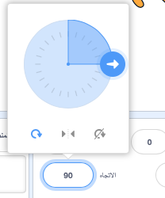
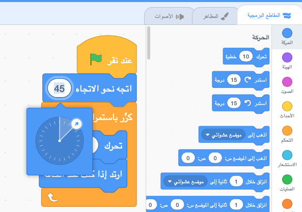

<iframe src="https://scratch.mit.edu/projects/542788512/embed" allowtransparency="true" width="485" height="402" frameborder="0" scrolling="no" allowfullscreen></iframe>

**الاتجاه** الخاص بالكائن يتحكم في مقدار تدويره.

عندما تضيف كائنًا جديدًا ، فإنه يشير إلى اليمين وهو اتجاه 90 درجة.

| اتجاه      | درجات  |
| ---------- | ------ |
| فوق        | 0      |
| **اليمين** | **90** |
| تحت        | 180    |
| يسار       | -90    |

يمكنك تغيير اتجاه الكائن في لوحة الكائن. انقر فوق رقم الاتجاه وحرك السهم الذي يظهر ، أو اكتب رقمًا.

يمكنك أيضًا استخدام المقطع البرمجي `اتجه نحو الاتجاه`{:class="block3motion"}:

يتم استخدام اتجاه الكائن بواسطة المقطع البرمجي `تحرك`{: class = "block3motion"}. قد يؤدي تغيير اتجاه الكائن أيضًا إلى تغيير دوران مظهر الكائن`نمط الدوران`{:class="block3motion"}.
