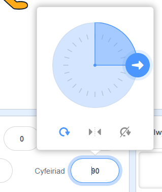
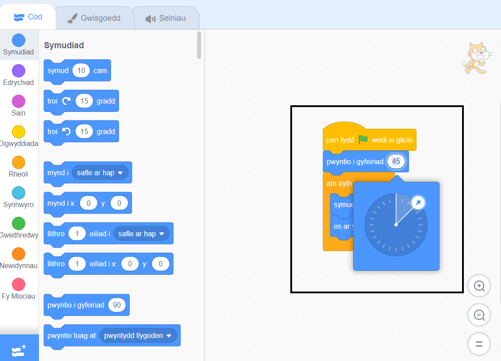

<iframe src="https://scratch.mit.edu/projects/542788512/embed" allowtransparency="true" width="485" height="402" frameborder="0" scrolling="no" allowfullscreen></iframe>

Mae'r **cyfeiriad** yn rheoli faint mae'r coflun yn cylchdroi.

Pan fyddi di'n ychwanegu coflun newydd bydd yn pwyntio i'r dde, sef cyfeiriad o 90 gradd.

| Cyfeiriad | Graddau |
| --------- | ------- |
| I fyny    | 0       |
| **Dde**   | **90**  |
| I lawr    | 180     |
| Chwith    | -90     |

Galli di ddim ond newid cyfeiriad y coflun yng nghwarel y Coflun. Clicia ar rif y cyfeiriad a symud y saeth sy'n ymddangos neu deipio rhif.

Galli di hefyd ddefnyddio'r bloc `pwyntio i gyfeiriad`{:class="block3motion"}:

Bydd y bloc `symud`{:class="block3motion"} yn defnyddio cyfeiriad y coflun. Gall newid cyfeiriad y coflun hefyd newid cylchdro gwisg y coflun yn dibynnu ar `arddull-cylchdroi`{:class="block3motion"} y coflun.
