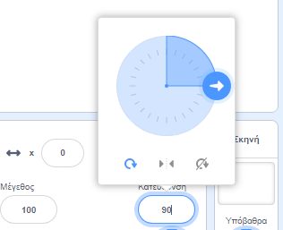
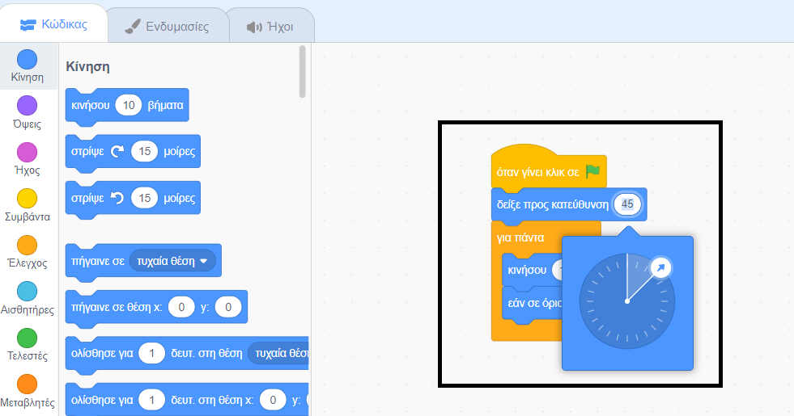

<iframe src="" allowtransparency="true" width="485" height="402" frameborder="0" scrolling="no" allowfullscreen></iframe>

Όταν προσθέτεις ένα νέο αντικείμενο αυτό δείχνει προς τα δεξιά που είναι μια κατεύθυνση 90 μοιρών.

| Κατεύθυνση | Μοίρες |
| ---------- | ------ |
| Πάνω       | 0      |
| **Δεξιά**  | **90** |
| Κάτω       | 180    |
| Αριστερά   | -90    |

Μπορείς να αλλάξεις την κατεύθυνση ενός αντικειμένου στο παράθυρο Αντικείμενο. Κάνε κλικ στον αριθμό κατεύθυνσης και μετακίνησε το βέλος που εμφανίζεται ή πληκτρολόγησε έναν αριθμό.

Μπορείς επίσης να χρησιμοποιήσεις το μπλοκ `δείξε προς κατεύθυνση`{:class="block3motion"}:

Η κατεύθυνση του αντικειμένου χρησιμοποιείται από το μπλοκ `κινήσου`{:class="block3motion"}. Η αλλαγή της κατεύθυνσης ενός αντικειμένου μπορεί επίσης να αλλάξει την περιστροφή της ενδυμασίας του ανάλογα με το `τρόπο περιστροφής`{:class="block3motion"}.
