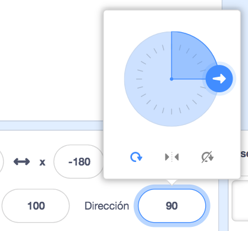

<iframe src="" allowtransparency="true" width="485" height="402" frameborder="0" scrolling="no" allowfullscreen></iframe>

Cuando agregas un nuevo objeto, este apunta a la derecha, que es una dirección de 90 grados.

| Dirección   | Grados |
| ----------- | ------ |
| Arriba      | 0      |
| **Derecha** | **90** |
| Abajo       | 180    |
| Izquierda   | -90    |

Puedes cambiar la dirección de un objeto en el Panel de objetos. Haz clic en el número en la opción Dirección y mueve la flecha que aparece, o escribe un número.

También puedes utilizar el bloque `apuntar en dirección`{:class="block3motion"}:

El bloque `mover` {:class="block3motion"} usa la dirección del objeto. Cambiar la dirección de un objeto también puede cambiar la rotación del disfraz dependiendo del `estilo de rotación`{:class="block3motion"}.
