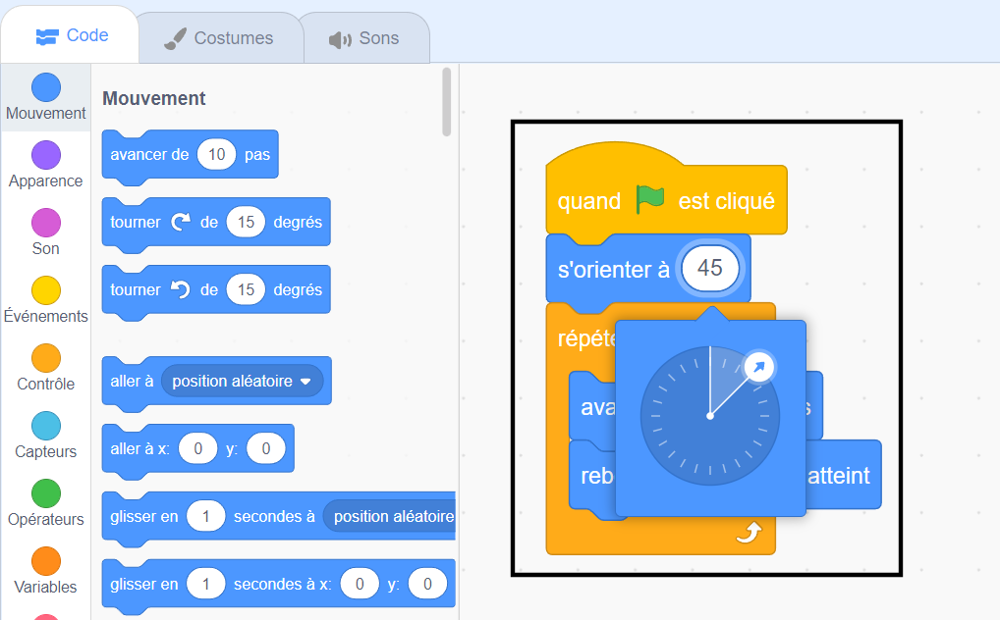

<iframe src="https://scratch.mit.edu/projects/542788512/embed" allowtransparency="true" width="485" height="402" frameborder="0" scrolling="no" allowfullscreen></iframe>

La **direction** d'un sprite contrôle de combien il est tourné.

Lorsque tu ajoutes un nouveau sprite, il pointe vers la droite, ce qui correspond à une direction de 90 degrés.

| Direction    | Degrés |
| ------------ | ------ |
| En haut      | 0      |
| **À droite** | **90** |
| Vers le bas  | 180    |
| À gauche     | -90    |

Tu peux changer la direction d'un sprite dans le volet Sprite. Clique sur le nombre dans direction et déplace la flèche qui apparaît, ou tape un nombre.

Tu peux également utiliser le bloc `s'orienter à`{:class="block3motion"} :

La direction du sprite est utilisée par le bloc `avancer`{:class="block3motion"}. Changer la direction d'un sprite peut également changer la rotation du costume du sprite en fonction du `sens de rotation`{:class="block3motion"} du sprite.
