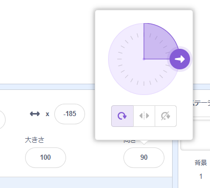
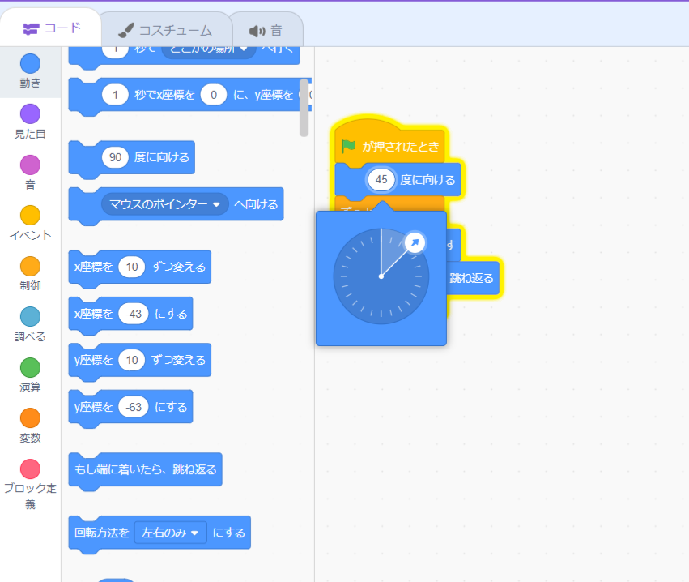

<iframe src="" allowtransparency="true" width="485" height="402" frameborder="0" scrolling="no" allowfullscreen></iframe>

新しいスプライトを追加すると、90度右へ傾きます。

| 方向    | 角度     |
| ----- | ------ |
| 上     | 0      |
| **右** | **90** |
| 下     | 180    |
| 左     | -90    |

スプライトペインでスプライトの方向を変更できます。 角度の度数をクリックして、表示される矢印を動かすか、数字を入力します。

`○度に向ける`{:class="block3motion"}ブロックを使うこともできます。

スプライトの方向は `動き`{:class="block3motion"} ブロックによって使われます。 スプライトの方向を変更すると、 `回転のスタイル`{:class="block3motion"}に応じて、スプライトのコスチュームの回転も変更される場合があります。
