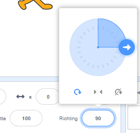
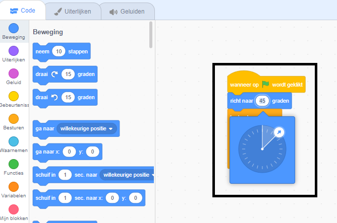

<iframe src="" allowtransparency="true" width="485" height="402" frameborder="0" scrolling="no" allowfullscreen></iframe>

Wanneer je een nieuwe sprite toevoegt, wijst deze naar rechts, een richting van 90 graden.

| Richting   | Graden |
| ---------- | ------ |
| Omhoog     | 0      |
| **Rechts** | **90** |
| Omlaag     | 180    |
| Links      | -90    |

Je kunt de richting van een sprite wijzigen in het Sprite-paneel. Klik op het richtingsgetal en verschuif de pijl die verschijnt, of typ een getal.

Je kunt ook het `richt naar`{:class="block3motion"} blok gebruiken:

De richting van de sprite wordt gebruikt door het `neem...stappen`{:class="block3motion"} blok. Het veranderen van de richting van een sprite kan ook de rotatie van het uiterlijk van de sprite veranderen, afhankelijk van de `draaistijl`{:class="block3motion"} van de sprite.
