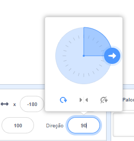
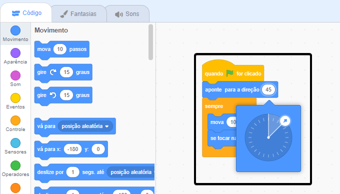

<iframe src="https://scratch.mit.edu/projects/542788512/embed" allowtransparency="true" width="485" height="402" frameborder="0" scrolling="no" allowfullscreen></iframe>

A **direção** de um ator controla o quanto ele é girado.

Quando você adiciona um novo ator, ele aponta para a direita, que é uma direção de 90 graus.

| Direção     | Graus  |
| ----------- | ----------- |
| Acima       | 0      |
| **Direita** | **90** |
| Abaixo      | 180    |
| Esquerda    | -90    |

Você pode alterar a direção de um ator no painel Ator. Clique no número da direção e mova a seta que aparece ou digite um número.

Você também pode usar o bloco `aponte para a direção`{:class="block3motion"}:

A direção do ator é usada pelo bloco `mova`{:class="block3motion"}. Alterar a direção de um ator também pode alterar a rotação do traje do ator dependendo do `estilo de rotação`{:class="block3motion"} do ator.
