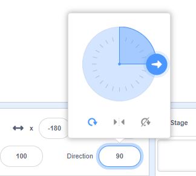
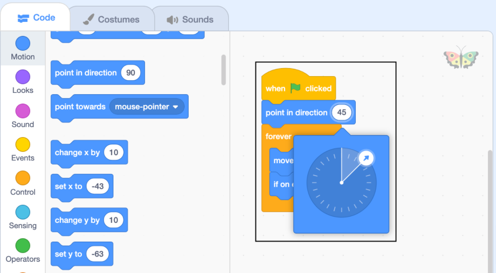

<iframe src="https://scratch.mit.edu/projects/542788512/embed" allowtransparency="true" width="485" height="402" frameborder="0" scrolling="no" allowfullscreen></iframe>

The **direction** of a sprite controls how much it is rotated.

When you add a new sprite it points to the right which is a direction of 90 degrees.

| Direction | Degrees |
| --------- | ------- |
| Up        | 0       |
| **Right** | **90**  |
| Down      | 180     |
| Left      | -90     |

You can change the direction of a sprite in the Sprite pane. Click on the direction number and move the arrow that appears, or type a number.

You can also use the `point in direction`{:class="block3motion"} block:

The sprite's direction is used by the `move`{:class="block3motion"} block. Changing the direction of a sprite may also change the rotation of the sprite's costume depending on the sprite's `rotation-style`{:class="block3motion"}.
