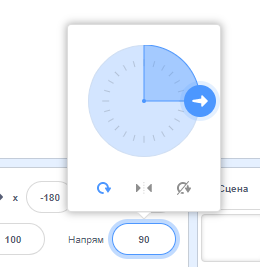
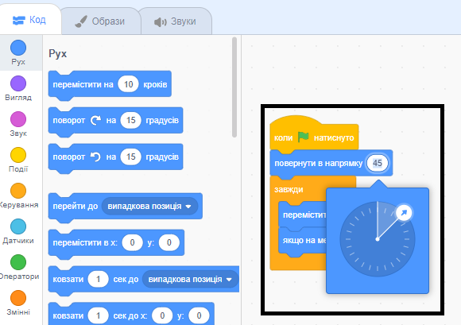

<iframe src="" allowtransparency="true" width="485" height="402" frameborder="0" scrolling="no" allowfullscreen></iframe>

Коли ти додаєш новий спрайт, він направлений вправо, тобто під кутом 90 градусів.

| Напрям       | Градуси |
| ------------ | ------- |
| Вверх        | 0       |
| **Праворуч** | **90**  |
| Вниз         | 180     |
| Ліворуч      | -90     |

Ти можеш змінювати напрямок руху спрайта на панелі Спрайт. Натисни на номер та переміщуй стрілку, що з'явилася, або введи номер.

Ти також можеш використовувати блок `повернути в напрямку`{:class="block3motion"}:

Напрямок руху спрайта встановлюється блоком `перемістити на`{:class="block3motion"}. Зміна напрямку руху спрайта може також змінити обертання образу спрайта залежно від блоку `стиль обертання` спрайта{:class="block3motion"}{:class="block3motion"}.
